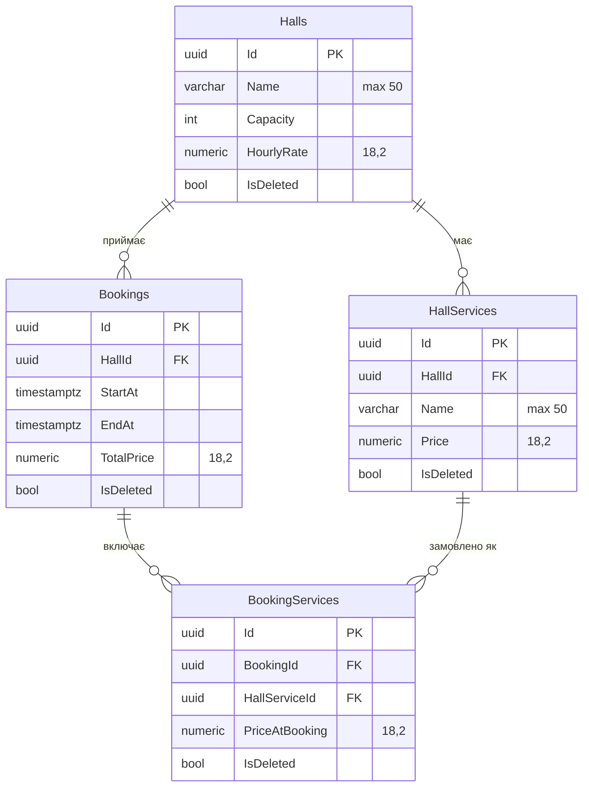

# Hallify

Бекенд-сервіс для бронювання залів: керування каталогом залів і додаткових послуг, пошук вільних залів на потрібний час, оформлення бронювання з автоматичним розрахунком вартості за динамічним погодинним тарифом та набір бізнес-звітів поверх накопичених даних.

Стек: **.NET 10 / ASP.NET Core Minimal API · EF Core 10 · PostgreSQL 18 · Docker Compose**.

---

## Зміст

- [Можливості](#можливості)
- [Архітектура](#архітектура)
- [Модель даних](#модель-даних)
- [Ціноутворення](#ціноутворення)
- [Швидкий старт](#швидкий-старт)
- [API](#api)
- [Звіти та аналітика](#звіти-та-аналітика)
- [Міграції](#міграції)
- [Обмеження та плани](#обмеження-та-плани)
- [Ліцензія](#ліцензія)

---

## Можливості

| Можливість | Опис |
|---|---|
| Каталог залів | CRUD залів із місткістю та базовою погодинною ставкою |
| Додаткові послуги | Кожен зал має власний перелік послуг (проєктор, звук, Wi-Fi тощо) з окремими цінами |
| Пошук вільних залів | Фільтр за інтервалом часу і мінімальною місткістю, без перетинів із наявними бронюваннями |
| Бронювання | Атомарне створення броні з перевіркою зайнятості та розрахунком підсумкової вартості |
| Динамічний тариф | Ціна години залежить від часу доби (ранкова знижка / пік / вечірня знижка) |
| Фіксація цін | Ціна послуги зберігається на момент бронювання — подальші зміни прайсу не змінюють історію |
| М'яке видалення | Зали, послуги та бронювання не видаляються фізично: історія й аналітика лишаються цілими |
| Бізнес-звіти | П'ять аналітичних зрізів: завантаженість, дохід, послуги, попит, зведений KPI |

---

## Архітектура

Рішення свідомо тримається двошаровим — окремий шар даних і тонкий HTTP-шар. Проміжний «сервісний» шар не вводився: логіка бронювання невелика й повністю прив'язана до транзакції БД, тож додатковий рівень абстракції дав би лише зайву передачу DTO між класами.

```
Hallify.slnx
├── HallifyApi/                     HTTP-шар (Minimal API)
│   ├── Program.cs                  composition root + операційні ендпоінти
│   ├── Queries/HallSearchQuery.cs  модель query-параметрів пошуку
│   └── Reports/
│       └── ReportEndpoints.cs      аналітичні ендпоінти /api/reports/*
├── HallifyDatabase/                шар даних і доменна логіка
│   ├── HallDbContext.cs            EF Core контекст, схема public
│   ├── HallDb.cs                   операційні сценарії (запис)
│   ├── HallRentalCalculator.cs     розрахунок вартості оренди
│   ├── Models/                     сутності + конфігурації + DTO
│   ├── Reports/                    аналітика (тільки читання)
│   │   ├── BusinessCalendar.cs     робочий календар і тарифна сітка
│   │   ├── ReportModels.cs         контракти звітів
│   │   └── ReportsDb.cs            запити та агрегації
│   └── Migrations/                 міграції EF Core
├── compose.yaml                    PostgreSQL для локальної розробки
└── migrate.sh                      застосування міграцій
```

Ключові технічні рішення:

- **`IDbContextFactory<HallDbContext>` замість scoped-контексту.** Кожна операція отримує власний короткоживучий контекст — немає ризику спільного стану між паралельними запитами й «протікання» трекінгу між сценаріями.
- **Конфігурації сутностей у `file`-класах.** `IEntityTypeConfiguration` оголошено з модифікатором `file` поруч із сутністю: конфігурація не «розповзається» по проєкту й водночас не потрапляє в публічний API збірки. Підключення — через `ApplyConfigurationsFromAssembly`.
- **Проєкція в DTO на рівні SQL.** `HallDto.FromHall` — це `Expression`, тому EF будує `SELECT` лише за потрібними колонками; сутності в пам'ять не матеріалізуються.
- **`AsNoTracking` для всіх читань.**
- **Розділення запису й читання.** `HallDb` — операційні сценарії, `ReportsDb` — аналітика. Різні вимоги до транзакцій і різний профіль навантаження.

---

## Модель даних



Про що варто знати:

- **Послуга належить конкретному залу.** «Проєктор у залі А» і «Проєктор у залі B» — різні записи з власними цінами. Це дозволяє відрізняти обладнання й тарифи різних приміщень.
- **`BookingServices.PriceAtBooking`** — знімок ціни на момент бронювання. Підняття прайсу не переписує вартість уже оформлених броней, а звіт по послугах може показати розрив між історичною та поточною ціною.
- **`Bookings.TotalPrice`** — підсумок, розрахований при створенні броні (оренда за динамічним тарифом + сума послуг). Зберігається, а не перераховується на льоту: рахунок клієнта не повинен змінюватися заднім числом.
- **`IsDeleted` на всіх сутностях**, `DeleteBehavior.NoAction` на всіх зв'язках. Каскадних видалень немає; видалення залу помічає його послуги видаленими в одній транзакції.
- **Початкові дані** (три зали по три послуги) закладені через `HasData` у міграції `AddStartData` — після `migrate.sh` система одразу придатна до демонстрації.

---

## Ціноутворення

Вартість = **оренда** + **сума замовлених послуг**.

Оренда рахується погодинно, з коефіцієнтом до базової ставки залу залежно від години доби. Неповна година тарифікується пропорційно (30 хв = 0,5 години).

| Локальний час (Київ) | Коефіцієнт | Логіка |
|---|---|---|
| 06:00 – 09:00 | ×0,9 | ранкова знижка — стимулювати попит у «мертві» години |
| 09:00 – 12:00 | ×1,0 | базовий тариф |
| 12:00 – 14:00 | ×1,15 | пік — найвищий попит на денні заходи |
| 14:00 – 18:00 | ×1,0 | базовий тариф |
| 18:00 – 23:00 | ×0,8 | вечірня знижка |

Обмеження, закладені в розрахунок (`HallRentalCalculator`):

- бронювання не може переходити на наступну добу;
- заклад працює лише з 06:00 до 23:00 — вихід за межі відхиляється.

> **Важливо про час.** Розрахунок бере `TimeOfDay` переданого `DateTimeOffset`, тобто час у **зміщенні клієнта**, і зіставляє його з сіткою, заданою в годинах UTC. Щоб коефіцієнти збіглися з наведеною вище таблицею, клієнт має надсилати час у UTC (`10:00` за Києвом → `2026-08-05T07:00:00Z`). Це слабке місце поточної реалізації — див. [Обмеження](#обмеження-та-плани). Звіти працюють інакше: вони явно конвертують час у пояс закладу (`BusinessCalendar`), тому завжди відповідають декларованій київській сітці.

**Приклад.** Зал А (базова ставка 2000 грн/год), бронювання 10:00–14:00 за Києвом, замовлені «Проєктор» (500) і «Звук» (700):

```
оренда  = 2000 × (1,0 + 1,0 + 1,15 + 1,15) = 8600
послуги = 500 + 700                        = 1200
разом                                      = 9800
```

> Тарифна сітка спочатку задана експертно. Звіт [`/api/reports/demand`](#звіт-4-попит-по-годинах-і-днях-тижня) показує фактичний попит поруч із чинним коефіцієнтом і дозволяє замінити припущення на цифри.

---

## Швидкий старт

**Потрібно:** .NET SDK 10, Docker.

```bash
# 1. Параметри БД
cp .env.example .env
#    заповніть DATABASE / USERNAME / PASSWORD

# 2. PostgreSQL
docker compose up -d

# 3. Рядок підключення для API
cd HallifyApi
dotnet user-secrets set "ConnectionStrings:DefaultConnection" \
  "Host=localhost;Port=5432;Database=<DATABASE>;Username=<USERNAME>;Password=<PASSWORD>"
cd ..

# 4. Міграції (потребує локального інструменту dotnet-ef)
dotnet tool restore
./migrate.sh

# 5. Запуск
dotnet run --project HallifyApi
```

API підніметься на `http://localhost:5063` (та `https://localhost:7233`). У режимі Development специфікація OpenAPI доступна за `/openapi/v1.json`.

---

## API

Формат обміну — JSON, час — `DateTimeOffset` в ISO 8601 із явним зміщенням.

### Зали

| Метод | Шлях | Призначення | Успіх |
|---|---|---|---|
| `GET` | `/api/halls` | Усі активні зали з їхніми послугами | `200 OK` |
| `GET` | `/api/halls/{id}` | Один зал | `200 OK` / `404` |
| `GET` | `/api/halls/available` | Вільні зали на інтервал | `200 OK` |
| `POST` | `/api/halls` | Створити зал разом із послугами | `201 Created`, id у тілі |
| `PUT` | `/api/halls/{id}` | Оновити зал і пакетно змінити його послуги | `200 OK` / `400` |
| `DELETE` | `/api/halls/{id}` | М'яке видалення залу та його послуг | `200 OK` / `400` |

### Бронювання

| Метод | Шлях | Призначення | Успіх |
|---|---|---|---|
| `POST` | `/api/halls/{id}/bookings` | Забронювати зал | `200 OK`, підсумкова вартість у тілі |

### Приклади

Пошук вільних залів:

```http
GET /api/halls/available?startAt=2026-08-05T10:00:00%2B03:00&endAt=2026-08-05T14:00:00%2B03:00&capacity=40
```

Створення залу:

```json
POST /api/halls
{
  "id": "00000000-0000-0000-0000-000000000000",
  "name": "Зал D",
  "capacity": 80,
  "hourlyRate": 2800,
  "hallServices": [
    { "id": "00000000-0000-0000-0000-000000000000", "name": "Проєктор", "price": 500 },
    { "id": "00000000-0000-0000-0000-000000000000", "name": "Кава-брейк", "price": 1200 }
  ]
}
```

Пакетне редагування залу — три незалежні набори змін в одному запиті:

```json
PUT /api/halls/11111111-1111-1111-1111-111111111111
{
  "id": "11111111-1111-1111-1111-111111111111",
  "name": "Зал А",
  "capacity": 60,
  "hourlyRate": 2200,
  "createHallServices": [ { "name": "Фліпчарт", "price": 200 } ],
  "updateHallServices": [ { "id": "a1111111-1111-1111-1111-111111111111", "name": "Проєктор 4K", "price": 800 } ],
  "deleteHallServices": [ "a2222222-2222-2222-2222-222222222222" ]
}
```

Бронювання (`duration` — у хвилинах, `bookingServices` — ідентифікатори послуг цього ж залу):

```json
POST /api/halls/11111111-1111-1111-1111-111111111111/bookings
{
  "id": "00000000-0000-0000-0000-000000000000",
  "startAt": "2026-08-05T10:00:00+03:00",
  "duration": 180,
  "bookingServices": [
    "a1111111-1111-1111-1111-111111111111",
    "a3333333-3333-3333-3333-333333333333"
  ]
}
```

Відповідь — підсумкова вартість, наприклад `7800.00`.

**Захист від подвійного бронювання.** Операція виконується в транзакції з рівнем ізоляції `Serializable`: перевірка перетину інтервалів і вставка запису відбуваються атомарно. Два одночасні запити на один слот не можуть обидва завершитися успішно — другий отримає `400`.

---

## Звіти та аналітика

Аналітичний контур — окрема група `/api/reports/*`, тільки читання. Спільні параметри для всіх звітів:

| Параметр | Тип | За замовчуванням |
|---|---|---|
| `from` | `DateTimeOffset` | `to` мінус 30 днів |
| `to` | `DateTimeOffset` | поточний момент |

Максимальна довжина періоду — 366 днів. У всі звіти потрапляють бронювання, **дата початку** яких належить періоду.

| Ендпоінт | Звіт | На яке питання бізнесу відповідає |
|---|---|---|
| `GET /api/reports/summary` | Зведений KPI | «Як ідуть справи загалом?» |
| `GET /api/reports/occupancy` | Завантаженість залів | «Який зал не окупається і що з ним робити?» |
| `GET /api/reports/revenue` | Динаміка доходу | «Куди рухається виручка і з чого вона складається?» |
| `GET /api/reports/services` | Послуги | «Які послуги продаються, а які тримаємо дарма?» |
| `GET /api/reports/demand` | Попит по годинах | «Чи правильно налаштована тарифна сітка?» |

### Звіт 1: завантаженість залів

`GET /api/reports/occupancy?from=&to=`

По кожному залу: кількість бронювань, продані години, доступні години, коефіцієнт завантаження, дохід, дохід на одну доступну годину, середній чек, середня тривалість броні.

- `AvailableHours = дні періоду × 17` (робоче вікно 06:00–23:00)
- `UtilizationRate = BookedHours / AvailableHours`
- `RevenuePerAvailableHour` — головна метрика порівняння: вона враховує і завантаження, і ставку, тому дозволяє коректно зіставити дорогий великий зал із дешевим малим.

**Рішення, які підтримує:** перегляд ставки для недозавантажених залів, перепрофілювання чи об'єднання приміщень, обґрунтування інвестицій в обладнання найприбутковішого залу.

### Звіт 2: динаміка доходу

`GET /api/reports/revenue?from=&to=&granularity=day|week|month`

Виручка з розбивкою на **оренду** й **послуги** по днях, тижнях або місяцях, плюс середній чек і частка послуг у доході.

- `RentalRevenue = TotalPrice − Σ PriceAtBooking`
- `ServicesShare` — частка додаткових продажів у виручці

**Рішення, які підтримує:** планування завантаження персоналу за сезонністю, оцінка ефекту акцій «до і після», контроль частки допродажів як окремого KPI.

### Звіт 3: популярність і дохідність послуг

`GET /api/reports/services?from=&to=`

По кожній послузі: скільки разів замовлена, **attach rate** (частка бронювань цього залу, у які послугу включили), дохід, поточна ціна й середня ціна на момент бронювання.

- `AttachRate = TimesBooked / (кількість бронювань цього залу за період)`
- Розрив між `CurrentPrice` і `AveragePriceAtBooking` показує, що ціна нещодавно змінювалася — і чи не впав після цього попит.

**Рішення, які підтримує:** зняти з прайсу послуги з нульовим попитом, включити послугу зі стабільно високим attach rate у базову ставку, підняти ціну на дефіцитне обладнання.

### Звіт 4: попит по годинах і днях тижня

`GET /api/reports/demand?from=&to=`

Три зрізи: `byHour` (17 робочих годин), `byWeekday`, `heatmap` (день тижня × година). У розрізі годин поруч із фактичним попитом виводиться **чинний тарифний коефіцієнт**.

Це найцінніший звіт саме тому, що тарифна сітка була задана експертно. Якщо вечірні години зі знижкою ×0,8 показують завантаження, порівнянне з піком, знижка не потрібна — вона просто зменшує виручку. Якщо ранкові години з ×0,9 усе одно порожні, проблема не в ціні.

Дохід між годинами розподіляється пропорційно фактично зайнятим годинам броні.

**Рішення, які підтримує:** перегляд коефіцієнтів на основі даних, планування графіка персоналу й прибирання, вибір годин для акційних пропозицій.

### Звіт 5: зведений KPI

`GET /api/reports/summary?from=&to=`

Одна відповідь для дашборда: виручка та її структура, кількість бронювань, середній чек, середня тривалість, загальне завантаження, найдохідніший зал, найдохідніша послуга, найзавантаженіші година й день тижня.

### Підключення

Звіти постачаються як окремі файли й вмикаються двома рядками у `Program.cs`:

```csharp
using HallifyApi.Reports;
using HallifyDatabase.Reports;

builder.Services.AddScoped<ReportsDb>();   // поруч із AddScoped<HallDb>()

// ...

app.MapReports();                          // після решти MapGet/MapPost
```

### Технічні нотатки

Кожен звіт робить один похід у БД: пласка проєкція бронювань періоду плюс довідники залів і послуг; агрегація виконується в пам'яті. Для одного закладу період навіть у рік — це тисячі рядків, тож такий підхід дешевший за складні SQL-групування й лишає формули читабельними. Якщо обсяг зросте, ті самі формули переносяться в матеріалізоване подання без зміни контракту API.

Робочий календар і тарифна сітка винесені в `BusinessCalendar` — єдине місце, де описано години роботи закладу й коефіцієнти в локальному часі.

---

## Міграції

```bash
dotnet tool restore                 # локальний dotnet-ef 10.0.10
./migrate.sh                        # застосувати міграції

# створити нову міграцію
dotnet ef migrations add <Name> --project HallifyDatabase --startup-project HallifyApi
```

Наявні міграції: `InitialCreate` → `AddHallServicesRelation` → `AddDeletion` → `AddStartData`.

---

## Обмеження та плани

Свідомі межі поточної версії:

| Обмеження | Наслідок | Напрямок розвитку |
|---|---|---|
| Немає автентифікації й ролей | Будь-хто може редагувати каталог; CORS відкритий (`AllowAnyOrigin`) | JWT + ролі `Admin` / `Manager`, звіти — лише для менеджменту |
| Немає сутності клієнта | Бронювання анонімне; неможливі звіти за клієнтами, повторними візитами, LTV | Таблиця `Customers`, зв'язок із `Bookings` |
| Немає скасування броні | Поле `IsDeleted` у `Bookings` є, але ендпоінта немає; не рахується рівень скасувань | `DELETE /api/halls/{id}/bookings/{bookingId}` + звіт по скасуваннях і no-show |
| Локальний час зашитий у код | `HallRentalCalculator` оперує годинами UTC, а `TimeOfDay` у `DateTimeOffset` повертає час у зміщенні запиту — при іншому зміщенні клієнта тарифні межі поїдуть | Явна конверсія в часовий пояс закладу через `TimeZoneInfo` в одному місці (`BusinessCalendar`) |
| Виняток розрахунку не мапиться на HTTP | Бронювання поза робочими годинами або через північ дає `500` замість `400` з поясненням | Валідація до розрахунку + `ProblemDetails` |
| Немає пагінації | `GET /api/halls` віддає повний список | Пагінація за курсором |
| Немає автотестів | Тарифна сітка й перевірка перетинів — найризикованіші місця | Юніт-тести `HallRentalCalculator`, інтеграційні тести бронювання на Testcontainers |
| Немає обліку незадоволеного попиту | Не видно, скільки запитів пошуку завершилися без результату | Логування запитів `/api/halls/available` із нульовим результатом → звіт «втрачений попит» за годинами й місткістю |

---

## Ліцензія

MIT — див. [LICENSE](LICENSE).
